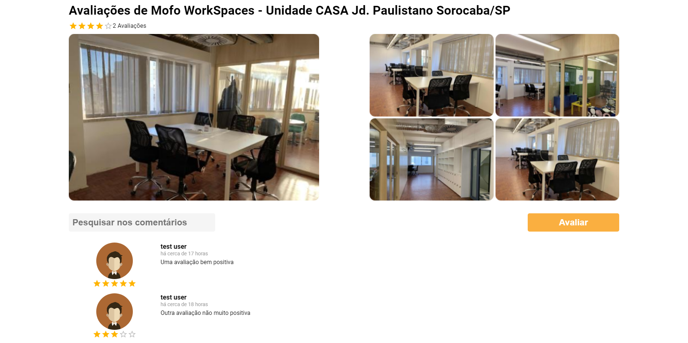

# Review or coffee

## Tecnologias utilizadas

### Frontend

-   React

-   Redux

-   Redux Saga

-   Redux Persist

### Backend

-   Node

-   Express

-   Sequelize

## Requisitos

-   Node na versão mais recente

-   Docker

## Dependências

Entre na pasta frontend do projeto e execute o comando `yarn ou npm i`, depois entre na pasta backend e faça o mesmo

## Preparar container do BD

### MySQL

`docker run -it --name bd-revieworcoffee -e MYSQL_ROOT_PASSWORD=docker -e MYSQL_ROOT_HOST=% -p 3306:3306 -d mysql:latest`

## Variáveis de ambiente

Antes de prosseguir você precisará criar um arquivo `.env` e configurá-lo corretamente seguindo o exemplo do arquivo `.env.example`

## Preparando o banco de dados

Depois de criar os containers será necessário criar um banco de dados no mysql chamado "revieworcoffee" e então executar as migrations com o comando `yarn migrate`

Em seguida execute o comando `yarn seed` para que o usuário de testes seja criado

Depois desta etapa você será capaz de fazer login no sistema com o usuário `test@test.com`, senha `123456` e fazer uma review

### Executando o frontend

Execute o comando `yarn start ou npm start`

### Executando o backend

Certifique-se de que o container está rodando e execute o comando `yarn dev ou npm run dev`

## Tela de review

## Modal de avaliação

## Debugger do redux

Para debuggar os estados do redux instale o Reactotron

https://github.com/infinitered/reactotron
